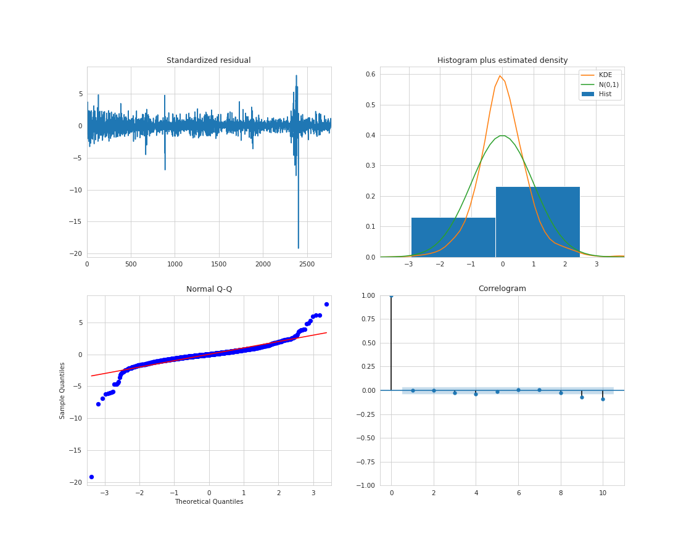
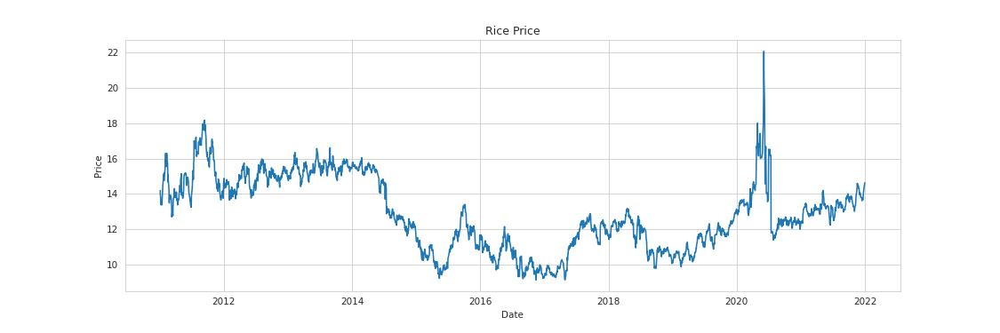
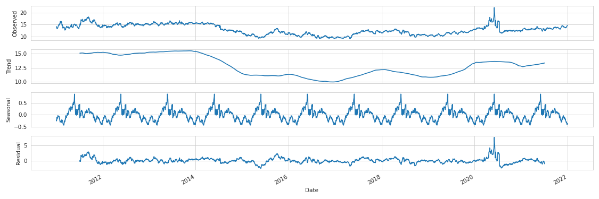
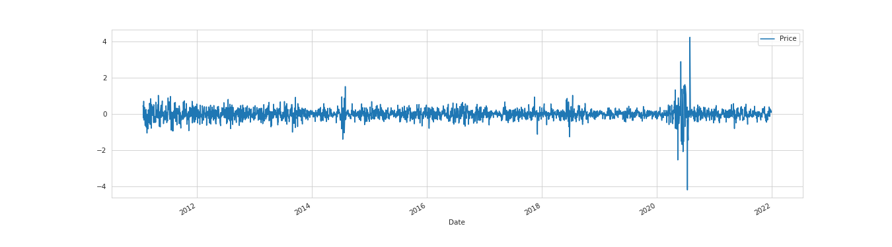
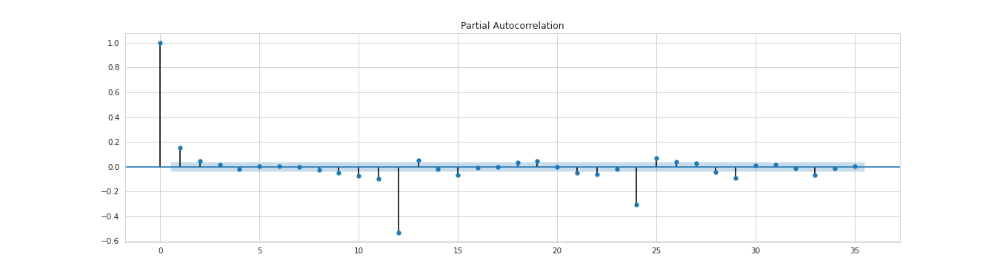
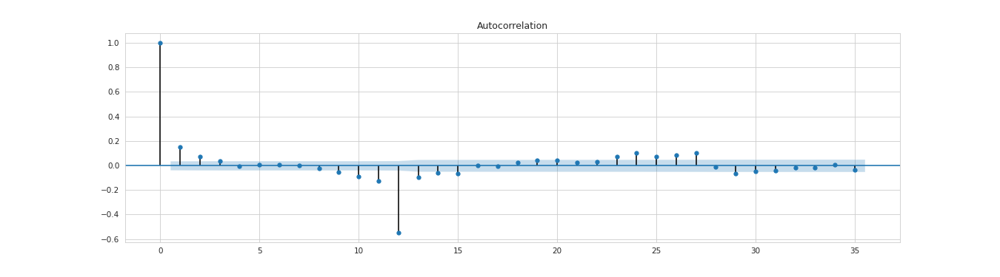

[](http://quantlet.de/)

## [](http://quantlet.de/) **SFM_Rough_Rice_Futures_Price** [](http://quantlet.de/)

```yaml

Name of Quantlet: SFM_Rough_Rice_Futures_Price

Published in: 'SFM'

Description: '(S)ARIMA Model for Rough Rice Futures Price from 2011 to 2021'

Keywords: 'Time series, ARIMA, stationarity, first difference, Augmented Dickey-Fuller test, PACF, ACF, Price Forecasting'

Author: 'Xingjia Wang'

See also: ''

Submitted:  '21.02.2022'

Additional Info : ''

```














